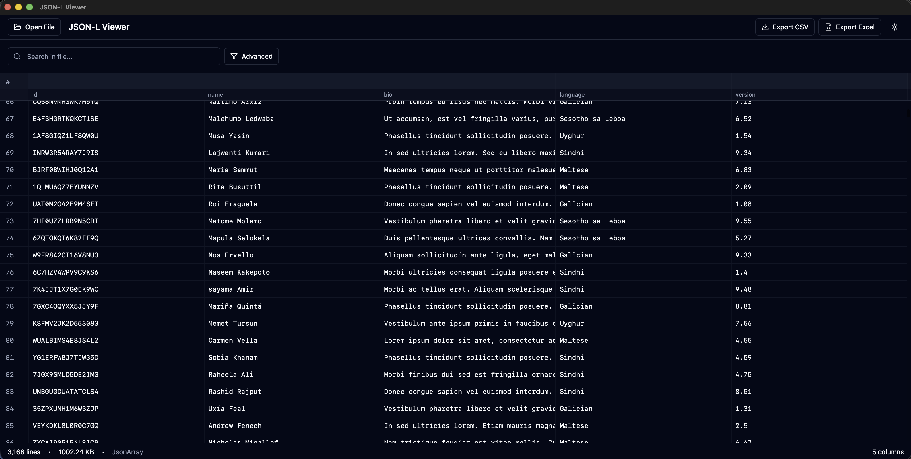

# JSON-L Viewer

A high-performance, modern desktop application for viewing, searching, and analyzing large JSON and JSON-L (Newline Delimited JSON) files. Built with **Tauri v2**, **Rust**, and **Svelte**, it handles gigabytes of data with ease.


## 🚀 Features

-   **Streaming Architecture**: Loads gigabytes of data instantly without blocking the UI.
-   **Virtual Scrolling**: Efficiently renders millions of rows using virtualization.
-   **Auto-Column Detection**: Automatically detects and flattens nested JSON structures into a readable table format.
-   **Smart Grouping**: Visually groups related headers (e.g., `user_name`, `user_id` → `USER`) for better readability.
-   **Search & Filter**: Real-time search functionality to quickly find specific records.
-   **Export Capabilities**: Export your filtered view or entire datasets to **CSV** or **Excel (.xlsx)**.
-   **Modern UI**: Clean, native-feeling interface with Dark and Light (Zinc) themes.
-   **Cross-Platform**: Runs natively on macOS, Windows, and Linux.

## 📸 Screenshots



## 🛠️ Tech Stack

-   **Frontend**: Svelte 5, TailwindCSS, Lucide Icons.
-   **Backend**: Rust (Tauri), Tokio (Async I/O), Serde.
-   **State Management**: Svelte Stores.
-   **Build Tool**: Vite.

## 📦 Installation

This project uses `pnpm` (or `npm`) for the frontend and `cargo` for the backend.

### Prerequisites

-   [Node.js](https://nodejs.org/) (v18+)
-   [Rust](https://www.rust-lang.org/tools/install) (v1.70+)
-   [Tauri CLI](https://tauri.app/v1/guides/getting-started/prerequisites)

### Development

1.  Clone the repository:
    ```bash
    git clone https://github.com/icampana/jsonl-viewer.git
    cd jsonl-viewer
    ```

2.  Install frontend dependencies:
    ```bash
    npm install
    ```

3.  Run the application in development mode:
    ```bash
    npm run tauri dev
    ```
    This will start the Vite dev server and compile the Rust backend.

### Building for Production

To create a release build for your operating system:

```bash
npm run tauri build
```

The build artifacts will be located in `src-tauri/target/release/bundle/`.

## 📖 Usage

1.  **Open File**: Drag and drop a `.json` or `.jsonl` file, or use `Cmd+O` (File -> Open).
2.  **Open from URL**: Use `Cmd+Shift+O` to load a file directly from a URL.
3.  **View Data**: Scroll through the virtualized list. Columns are automatically generated from your data.
4.  **Search**: Use the search bar efficiently filter rows based on content.
5.  **Export**: Click "Export" in the menu (`Cmd+E`) or status bar to save your current view to Excel or CSV.

### 🧪 Test Data

You can test the application using the sample datasets provided by Microsoft Edge:
[JSON Dummy Data](https://microsoftedge.github.io/Demos/json-dummy-data/)

Example URL to try:
`https://microsoftedge.github.io/Demos/json-dummy-data/1MB.json`

## 🤝 Contributing

Contributions are welcome! Please feel free to submit a Pull Request.

1.  Fork the Project
2.  Create your Feature Branch (`git checkout -b feature/AmazingFeature`)
3.  Commit your Changes (`git commit -m 'Add some AmazingFeature'`)
4.  Push to the Branch (`git push origin feature/AmazingFeature`)
5.  Open a Pull Request

## 📄 License

This project is open source and available under the [MIT License](LICENSE).
